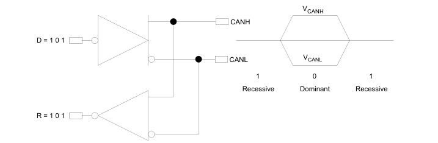
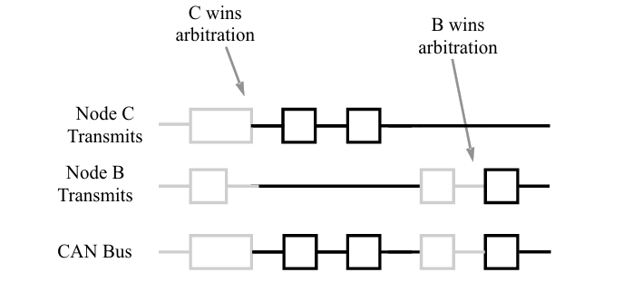

> [**source**](https://www.ti.com/lit/an/sloa101b/sloa101b.pdf)

---

> Controller Area Network (CAN) cực kỳ phù hợp với bất kỳ giao thức công nghiệp cấp cao nào, nó bao gồm CAN và ISO-11898:2003 làm lớp vật lý của chúng.
>
> Chi phí, hiệu suất và khả năng nâng cấp mang lại sự linh hoạt trong việc thiết kế hệ thống.

# 1 Giới thiệu

CAN bus được phát triển bởi BOSH như một “hệ thống phát thông điệp đa chủ” quy định tốc độ tín hiệu tối đa là 1 megabit mỗi giấy (bps). Không giống như mạng truyền thông như USB hoặc Ethernet, CAN không gửi các gói dữ liệu lớn từ node A đến node B dưới sự giám sát của bus master trung tâm. Trong mạng CAN, có nhiều dữ liệu ngắn chứa các thông tin như nhiệt độ hoặc RPM được phát **(broadcast)** đến toàn bộ mạng, điều này cung cấp tính nhất quán của dữ liệu trong mỗi node của hệ thống.

# 2 Tiêu chuẩn CAN

CAN là một bus truyền thông nối tiếp do International Standardization Organization (ISO) (Tổ chức Tiêu chuẩn hoá Quốc tế) định nghĩa ban đầu được phát triển cho ngành công nghiệp ô tô để thay thế hệ thống dây điện phức tạp bằng “bus 2 dây”. Đặc điểm kỹ thuật này yêu cầu khả năng miễn nhiễm cao với nhiễu điện, khả năng tự chuẩn đoán và sửa lỗi dữ liệu. Những tính năng này đã dẫn đến sự phổ biến của CAN trong nhiều ngành công nghiệp khác như tự động hoá toà nhà (Building Automation), y tế và sản xuất, …

Giao thức truyền thông CAN, ISO-11898:2003, mô tả cách thông tin được truyền giữa các thiết bị trên mạng và tuân thủ mô hình Open Systems Interconnection (OSI) được định nghĩa theo các lớp. Trong mô hình OSI gồm 7 tầng, giao tiếp thực tế giữa các thiết bị thông qua phương tiện truyền dẫn được xác định bởi **tầng vật lý (Physical Layer)**. Kiến trúc ISO 11898 quy định **hai tầng thấp nhất** của mô hình OSI, bao gồm **tầng liên kết dữ liệu (Data-Link Layer) và tầng vật lý (Physical Layer)** như trong **Hình 1**.

**Hình 1. Kiến trúc tiêu chuẩn ISO 11898 phân lớp**

Trong **Hình 1** lớp ứng dụng (Application Layer) thiết lập liên kết truyền thông đến một giao thức cụ thể của ứng dụng cấp cao hơn như giao thức CANopen. Giao thức này được hỗ trợ bởi nhóm người dùng và nhà sản xuất quốc tế, CAN in Automation (CiA). Thông tin bổ sung về CAN có tại trang web [CAN in Automation (CiA)](https://can-cia.org/). Nhiều giao thức dành riêng cho từng ứng dụng cụ thể như tự động hoá công nghiệp, động cơ diesel hoặc hàng không. Các ví dụ dựa trên CAN theo tiêu chuẩn công nghiệp là CAN Kingdom của KVASER và DeviceNet của Rockwell Automation.

# 3 Tiêu chuẩn CAN và CAN mở rộng

**Tài liệu tham khảo:** [Difference between Standard CAN and Extended CAN frame](https://automotivevehicletesting.com/standard-can-and-extended-can-frame/)

Giao thức truyền thông CAN là một giao thức truy cập nhiều node **(multiple-access)** theo phương thức cảm biến sóng mang **(carrier-sense)**, với phát hiện xung đột **(collision detection)** và phân quyền dựa trên độ ưu tiên **(AMP)** của thông điệp (arbitration on message priority – CSMA/CD+AMP). **(**Carrier Sense Multiple Access with Collision Detection and Arbitration on Message Priority**)** — đây là cơ chế đặc trưng của giao thức CAN.

**CSMA** có nghĩa là mỗi node trong bus phải chờ trong 1 khoảng thời gian không hoạt động được quy định trước khi cố gắng gửi tin nhắn.

> **Ý nghĩa:**
>
> -   Mỗi **node (thiết bị)** nối trên **bus (kênh truyền chung)** không được gửi dữ liệu ngay lập tức.
> -   Node phải **lắng nghe kênh** và **đợi một khoảng thời gian yên lặng (inactivity)**.
> -   Nếu sau thời gian đó, kênh vẫn **không có ai gửi (trống)** → node **bắt đầu truyền** dữ liệu.
> -   Nếu có thiết bị khác bắt đầu truyền → **node phải chờ tiếp**.
>
> **Tưởng tượng một cuộc họp:**
> Mọi người **ngồi quanh bàn** (giống như các thiết bị trên bus).
>
> -   Ai muốn nói, phải **chờ cho đến khi không ai nói**.
> -   **Nếu có người nói**, bạn phải **đợi họ nói xong** (kênh bận).
> -   **Sau khi họ dừng lại**, bạn còn phải **chờ thêm 1-2 giây (prescribed period)** để chắc chắn rằng không ai khác sắp nói.
> -   Nếu vẫn **im lặng**, bạn **có thể bắt đầu nói** (gửi dữ liệu).

**CD+AMP** Nếu có nhiều node gửi dữ liệu cùng lúc, xung đột được giải quyết bằng cách phân quyền bit theo mức ưu tiên đã được lập trình sẵn trong trường định danh (Identifier) của khung tin CAN

-   **Thông điệp có độ ưu tiên cao hơn luôn thắng quyền truy cập bus.**
-   Cụ thể, **bit có giá trị logic cao nhất (dominant - 0) sẽ luôn thắng trên bus.**
-   Mỗi node đều kiểm tra **bit mà nó vừa gửi đi**, nếu thấy bit đó bị ghi đè (overwritten), nó sẽ **nhận ra rằng có một thông điệp có độ ưu tiên cao hơn đang được gửi**."

Tiêu chuẩn ISO-11898:2003 với mã định danh 11 bit chuẩn, cung cấp độ tín hiệu từ 125kbs đến 1 Mbps. Tiêu chuẩn này sau đó đã được sửa đổi với mã định danh 29 bit “mở rộng”. Trường mã định danh 11 bit tiêu chuẩn trong **Hinh 2** cung cấp 2^11 hoặc 2048 mã định danh thông điệp khác nhau, trong khi mã định danh 29 bit mở rộng trong **Hình 3** cung cấp 2^29 \*\*\*\*hoặc 537 triệu mã định danh.

## 3.1 Các trường bit của tiêu chuẩn CAN và CAN mở rộng

### 3.1.1 Tiêu chuẩn CAN

**Hình 2. Tiêu chuẩn CAN: 11 bit định danh**

Ý nghĩa của các trường bit trong **Hình 2** là:

-   **SOF** — Bit SOF (Start of Frame) duy nhất ở mức dominant đánh dấu sự bắt đầu của một khung thông điệp và được sử dụng để đồng bộ các node trên bus sau một khoảng thời gian không hoạt động.
-   **Identifier** — Định danh (Identifier) 11-bit của CAN chuẩn thiết lập mức ưu tiên của thông điệp. Giá trị nhị phân càng thấp thì mức ưu tiên càng cao.
-   **RTR** — Bit yêu cầu truyền từ xa (RTR) duy nhất sẽ ở mức dominant khi cần lấy thông tin từ một node khác. Tất cả các node đều nhận được yêu cầu này, nhưng trường định danh (Identifier) sẽ xác định node cụ thể cần phản hồi. Dữ liệu phản hồi từ node đó cũng sẽ được tất cả các node khác nhận và các node nào quan tâm đều có thể sử dụng. Nhờ đó, toàn bộ dữ liệu được sử dụng trong hệ thống đều đồng nhất.
-   **IDE** — **Identifier extension (IDE)**. Một bit mở rộng định danh ở mức dominant nghĩa là khung CAN đang dùng ID chuẩn (11-bit), không mở rộng.
-   **r0** — Bit dự trữ (được giữ lại để có thể sử dụng cho các sửa đổi tiêu chuẩn trong tương lai).
-   **DLC** — Trường mã độ dài dữ liệu (DLC) gồm 4 bit, chứa số byte dữ liệu sẽ được truyền trong khung.
-   **Data** — Có thể truyền tối đa 64 bit dữ liệu ứng dụng trong một khung.
-   **CRC** — Trường kiểm tra tuần hoàn 16 bit (gồm 15 bit CRC và 1 bit phân cách - delimiter) chứa mã kiểm tra (checksum) được tính từ các bit dữ liệu ứng dụng trước đó để phát hiện lỗi.
-   **ACK** — Mỗi node nhận được một thông điệp chính xác sẽ ghi đè bit recessive trong thông điệp gốc bằng bit dominant, nhằm báo hiệu rằng thông điệp đã được gửi không lỗi. Nếu một node phát hiện lỗi và giữ nguyên bit này ở mức recessive, nó sẽ loại bỏ thông điệp, và node gửi sẽ phải gửi lại thông điệp sau khi tranh quyền lại trên bus (rearbitration). Theo cách này, mỗi node đều xác nhận (ACK) tính toàn vẹn của dữ liệu. ACK gồm 2 bit, một là bit xác nhận (acknowledgment bit), và một là bit phân cách (delimiter).
-   **EOF** — EOF (End of Frame) là trường gồm 7 bit, đánh dấu kết thúc của một khung tin CAN (message) và ngăn việc chèn bit (bit stuffing). Nếu trường này có mức dominant (0) sẽ chỉ ra lỗi chèn bit (stuffing error). Trong hoạt động bình thường, khi có 5 bit liên tiếp cùng mức logic, một bit đối lập sẽ được chèn vào để tránh hiểu nhầm.
-   **IFS** — IFS (khoảng cách giữa các khung) là trường gồm 7 bit, chứa khoảng thời gian mà bộ điều khiển (controller) cần để chuyển một khung tin đã nhận chính xác vào vùng bộ đệm (message buffer) phù hợp.

### 3.1.2 CAN mở rộng

**Hình 3. CAN mở rộng: 29 bit định danh**

Trong **Hình 3** CAN mở rộng giống với tiêu chuẩn CAN nhưng có thêm:

-   **SSR** — **SRR là bit thay thế cho bit RTR** (Remote Transmission Request) ở vị trí giống như RTR trong CAN tiêu chuẩn, **làm nhiệm vụ giữ chỗ (placeholder)** trong định dạng mở rộng (Extended Format).
-   **IDE** —**IDE là bit recessive (1)** nằm trong trường mở rộng định danh (Identifier Extension), **cho biết rằng phía sau còn có thêm các bit định danh (identifier)**. Sau IDE sẽ là **18 bit mở rộng thêm (Extended Identifier)**
-   **r1** — **Sau các bit RTR và r0**, có thêm một bit dự phòng (reserve bit) mới **trước trường DLC (Data Length Code)** để dành cho việc mở rộng tiêu chuẩn trong tương lai.

# 4 Thông điệp CAN

## 4.1 Arbitration (Phân xử)

Một đặc tính cơ bản của CAN, được hiển thị trong **Hình 4**, là trạng thái logic đối lập giữa bus, đầu vào bộ truyền (driver input), và đầu ra bộ thu (receiver output).
Thông thường, mức logic cao (logic-high) được hiểu là bit 1, và mức logic thấp (logic-low) được hiểu là bit 0 – nhưng không phải trên bus CAN.

Do đó, các bộ thu phát CAN của Texas Instruments (TI) có các chân đầu vào của bộ truyền và đầu ra của bộ thu được kéo lên mức cao một cách thụ động **(passively pulled high)** bên trong.
Nhờ vậy, khi không có đầu vào nào, thiết bị sẽ tự động mặc định về trạng thái bus "recessive" trên tất cả các chân đầu vào và đầu ra.

**Hình 4. Logic đảo ngược của Bus CAN**

> **1. Trạng thái logic của bus CAN ngược với logic thông thường**
>
> Thông thường trong điện tử:
>
> -   Logic 1 → Điện áp cao
> -   Logic 0 → Điện áp thấp
>
> 🚗 Nhưng trên bus CAN:
>
> -   Bit 1 (Recessive) = Điện áp thấp (không có tín hiệu)
> -   Bit 0 (Dominant) = Điện áp cao (có tín hiệu chủ động)
>
> ➡️ Tức là:
>
> -   Khi bus rảnh → nó ở trạng thái "recessive" (bit 1).
>
> -   Khi có tín hiệu "dominant" (bit 0) → điện áp tăng lên do có một node chủ động truyền dữ liệu.
>
> **2. Tại sao cần thiết kế như vậy?**
>
> -   Trạng thái "recessive" mặc định giúp tiết kiệm điện năng và dễ phát hiện khi có dữ liệu được truyền.
>
> -   Cơ chế bit-wise arbitration (ưu tiên ID thấp hơn) hoạt động dựa trên logic này.
>
> -   Giúp phát hiện lỗi dễ dàng hơn: Nếu bus đang "recessive" mà một node gửi "dominant" (0) nhưng không ai nhận được, ta biết có lỗi trên bus.

Truy cập bus trong CAN được kích hoạt theo sự kiện **(event-driven)** và diễn ra ngẫu nhiên.
Nếu hai node cố gắng truyền dữ liệu cùng lúc, quyền truy cập bus sẽ được quyết định bằng cơ chế arbitration bit-wise mà không phá hủy dữ liệu **(nondestructive arbitration)**. **Nondestructive** nghĩa là node thắng arbitration tiếp tục gửi dữ liệu mà không bị gián đoạn hoặc gây lỗi trên bus.

Việc gán mức độ ưu tiên cho thông điệp dựa vào trường Identifier là một đặc điểm quan trọng của CAN, giúp nó đặc biệt phù hợp với các hệ thống điều khiển thời gian thực (real-time control).

Số Identifier càng nhỏ (giá trị nhị phân thấp), độ ưu tiên càng cao.
Ví dụ: Một Identifier toàn số 0 là thông điệp có mức ưu tiên cao nhất vì nó giữ trạng thái dominant (0) lâu nhất trên bus.

Vì vậy, nếu hai node bắt đầu truyền cùng lúc, node gửi bit cuối của Identifier là 0 (dominant) trong khi node khác gửi 1 (recessive), thì node có bit 0 sẽ giữ quyền kiểm soát bus và hoàn tất việc truyền.

Trên bus CAN, một bit dominant (0) luôn ghi đè (overwrite) một bit recessive (1).

**Lưu ý rằng một node truyền luôn giám sát từng bit của chính nó trong quá trình truyền dữ liệu**.

Đây là lý do tại sao sơ đồ cấu hình transceiver trong **Hình 4** có các chân đầu ra CANH và CANL của bộ phát được kết nối nội bộ với đầu vào của bộ thu. Độ trễ lan truyền của tín hiệu trong vòng lặp nội bộ từ đầu vào bộ phát đến đầu ra bộ thu thường được sử dụng để đo lường chất lượng của transceiver CAN. Độ trễ này được gọi là loop time (tLOOP trong datasheet của TI), nhưng các nhà cung cấp khác nhau có thể đặt tên khác nhau cho thông số này.

> 🔎 💡 Giải thích:
>
> -   Trong CAN, mỗi node vừa phát vừa nghe (bit monitoring).
> -   Mỗi bit mà một node gửi đi sẽ được chính nó kiểm tra lại ngay lập tức để đảm bảo không có lỗi.
> -   Vì vậy, nếu một node gửi "1" (recessive) mà lại nhận "0" (dominant), nó >biết rằng một node khác có độ ưu tiên cao hơn đang gửi và phải dừng lại.

**Hình 5** minh họa quá trình arbitration của CAN, được xử lý hoàn toàn tự động bởi bộ điều khiển CAN.

Mỗi node liên tục giám sát chính tín hiệu mà nó đang gửi đi.
Ví dụ, khi node B gửi bit recessive (1), nhưng bị ghi đè bởi bit dominant (0) của node C (có độ ưu tiên cao hơn),
node B sẽ phát hiện rằng trạng thái bus không giống với bit mà nó đã gửi.

Do đó, node B ngay lập tức dừng truyền, trong khi node C tiếp tục gửi dữ liệu.

Sau khi node C truyền xong và giải phóng bus, node B sẽ thử gửi lại dữ liệu của mình.

Quá trình này là một phần của lớp tín hiệu vật lý (physical signaling layer) trong tiêu chuẩn ISO 11898.
Vì vậy, nó được xử lý hoàn toàn bên trong bộ điều khiển CAN và người dùng không cần quan tâm đến quá trình này.

**Hình 5. Phân xử trên Bus CAN**

Việc phân bổ mức độ ưu tiên của thông điệp là do nhà thiết kế hệ thống quyết định. Tuy nhiên, trong thực tế, các nhóm trong ngành thường thống nhất với nhau về ý nghĩa của một số loại thông điệp nhất định.

> Ví dụ, một nhà sản xuất động cơ có thể quy định rằng thông điệp có ID 0010 là tín hiệu phản hồi về dòng điện trong cuộn dây của động cơ, còn ID 0011 là thông tin về tốc độ quay từ cảm biến tachometer.
>
> Vì ID 0010 có giá trị nhị phân nhỏ hơn ID 0011, nên thông điệp liên quan đến dòng điện luôn có mức độ ưu tiên cao hơn so với thông điệp về tốc độ quay trên mạng CAN.

Trong trường hợp của DeviceNet™, các thiết bị từ nhiều nhà sản xuất khác nhau, chẳng hạn như công tắc tiệm cận và cảm biến nhiệt độ, có thể được tích hợp vào cùng một hệ thống.

Vì các thông điệp do cảm biến DeviceNet tạo ra đã được **Open DeviceNet Vendors Association (ODVA)** xác định trước, nên một loại thông điệp cụ thể luôn tương ứng với một loại cảm biến nhất định, chẳng hạn như cảm biến nhiệt độ, bất kể nó được sản xuất bởi hãng nào.

## 4.2 Message Types (Kiểu thông điệp)

Có bốn loại thông điệp (hay còn gọi là khung dữ liệu - frame) khác nhau có thể được truyền trên mạng CAN, bao gồm:

1. Data Frame (Khung dữ liệu)
2. Remote Frame (Khung yêu cầu từ xa)
3. Error Frame (Khung lỗi)
4. Overload Frame (Khung quá tải)

Xem **Hình 2** và **Hình 3** để biết chi tiết.

### 4.2.1 The data frame (Khung dữ liệu)

Khung dữ liệu (Data Frame) là loại thông điệp phổ biến nhất trong mạng CAN. Nó bao gồm các trường sau:

1. **Trường phân quyền (Arbitration Field):**
    - Chứa mã định danh (Identifier) 11 bit **Hình 2** hoặc 29 bit **Hình 3**.
    - Chứa bit RTR (Remote Transmission Request), bit này sẽ có trạng thái dominant (0) trong khung dữ liệu.
2. **Trường dữ liệu (Data Field):**
    - Chứa từ 0 đến 8 byte dữ liệu thực tế.
3. **Trường kiểm tra lỗi (CRC Field):**
    - Chứa giá trị kiểm tra lỗi (Checksum) 16 bit dùng để phát hiện lỗi trong quá trình truyền dữ liệu.
4. **Trường xác nhận (Acknowledgment Field - ACK):**
    - Xác nhận rằng khung dữ liệu đã được nhận chính xác.

### 4.2.2 The Remote Frame (Khung yêu cầu từ xa)

Khung yêu cầu từ xa (Remote Frame) tương tự như khung dữ liệu (Data Frame) nhưng có hai điểm khác biệt quan trọng:

1. Bit RTR (Remote Transmission Request) có trạng thái "recessive" (1) trong trường phân quyền (Arbitration Field), đánh dấu đây là một khung yêu cầu từ xa.
2. Khung này không chứa dữ liệu (Data Field trống).

### 4.2.3 The Error Frame (Khung lỗi)

Khung lỗi (Error Frame) được gửi khi một node phát hiện lỗi trong quá trình truyền dữ liệu trên bus CAN.

Cấu trúc của Khung lỗi:

1. **Trường lỗi chủ động (Active Error Flag):**
    - Do node phát hiện lỗi gửi ra.
    - Gồm 6 bit dominant (0) liên tiếp, giúp báo hiệu lỗi đến tất cả các node khác trên mạng.
2. **Trường lỗi thụ động (Passive Error Flag - nếu có):**
    - Do node bị lỗi ở trạng thái lỗi thụ động gửi ra.
    - Gồm 6 bit recessive (1) liên tiếp, không gây ảnh hưởng đến bus.
3. **Trường lỗi cuối (Error Delimiter):**
    - Gồm 8 bit recessive (1) để kết thúc khung lỗi.

> 🚨 Mục đích:
>
> -   Khi một node phát hiện lỗi, nó gửi Error Frame để báo hiệu cho các node khác hủy bỏ thông điệp hiện tại.
>
> -   Sau đó, thông điệp có thể được truyền lại.
>
> 🔥 Kết luận: Error Frame giúp đảm bảo tính toàn vẹn dữ liệu trên mạng CAN bằng cách phát hiện và xử lý lỗi ngay lập tức.

### 4.2.4 Overload Frame (Khung quá tải)

Khung quá tải (Overload Frame) được đề cập để đảm bảo tính đầy đủ của giao thức. Nó có định dạng tương tự như khung lỗi (Error Frame), nhưng có một số điểm khác biệt.

**Mục đích của Overload Frame:**

-   Được gửi bởi một node đang bị quá tải (quá bận để xử lý thêm dữ liệu).
-   Chủ yếu được sử dụng để tạo thêm độ trễ giữa các thông điệp, giúp node có thêm thời gian xử lý.

**Cấu trúc:**

-   Giống với Error Frame về mặt định dạng, nhưng không phải do lỗi mà do nhu cầu trì hoãn truyền thông.

**🔥 Kết luận: Overload Frame giúp điều chỉnh tốc độ truyền thông trong trường hợp một node chưa kịp xử lý hết dữ liệu, đảm bảo hệ thống hoạt động ổn định.**

## 4.3 A Valid Frame (Khung hợp lệ)

Một thông điệp được coi là không có lỗi khi bit cuối cùng của trường Kết thúc Khung (EOF - End of Frame) được nhận ở trạng thái recessive (1) mà không có lỗi.

🚨 Nếu có bit dominant (0) xuất hiện trong trường EOF:

-   Điều này báo hiệu rằng có lỗi xảy ra.
    node truyền sẽ phải gửi lại thông điệp đó.

**🔥 Kết luận: EOF giúp đảm bảo rằng chỉ những thông điệp không có lỗi mới được chấp nhận, còn những thông điệp có lỗi sẽ bị truyền lại.**

## 4.4 Error Checking and Fault Confinement (Kiểm tra lỗi và giới hạn lỗi)
