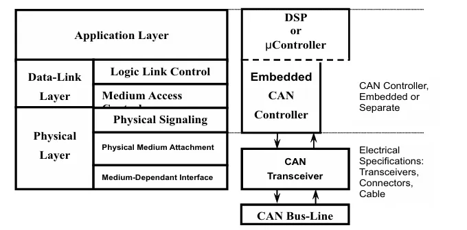
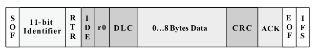
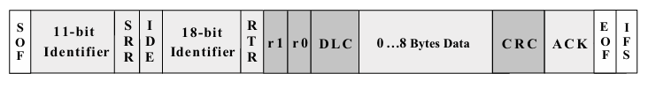

## Mục lục
1. [Giới thiệu](#1-giới-thiệu)
2. [Tiêu chuẩn CAN](#2-tiêu-chuẩn-can)
3. [Tiêu chuẩn CAN và CAN mở rộng](#3-tiêu-chuẩn-can-và-can-mở-rộng)
    - [3.1 Các trường bit của tiêu chuẩn CAN và CAN mở rộng](#31-các-trường-bit-của-tiêu-chuẩn-can-và-can-mở-rộng)
        - [3.1.1 Tiêu chuẩn CAN](#311-tiêu-chuẩn-can)
        - [3.1.2 CAN mở rộng](#312-can-mở-rộng)
4. [Thông điệp CAN](#4-thông-điệp-can)
    - [4.1 Arbitration (Phân xử)](#41-arbitration-phân-xử)
    - [4.2 Message Types (Kiểu thông điệp)](#42-message-types-kiểu-thông-điệp)
    - [4.3 A Valid Frame (Khung hợp lệ)](#43-a-valid-frame-khung-hợp-lệ)
    - [4.4 Error Checking and Fault Confinement (Kiểm tra lỗi và giam giữ lỗi)](#44-error-checking-and-fault-confinement-kiểm-tra-lỗi-và-giam-giữ-lỗi)

---

> Controller Area Network (CAN) cực kỳ phù hợp với bất kỳ giao thức công nghiệp cấp cao nào, nó bao gồm CAN và ISO-11898:2003 làm lớp vật lý của chúng.
>
>Chi phí, hiệu suất và khả năng nâng cấp mang lại sự linh hoạt trong việc thiết kế hệ thống.

# 1 Giới thiệu

CAN bus được phát triển bởi BOSH như một “hệ thống phát thông điệp đa chủ” quy định tốc độ tín hiệu tối đa là 1 megabit mỗi giấy (bps). Không giống như mạng truyền thông như USB hoặc Ethernet, CAN không gửi các gói dữ liệu lớn từ node A đến node B dưới sự giám sát của bus master trung tâm. Trong mạng CAN, có nhiều dữ liệu ngắn chứa các thông tin như nhiệt độ hoặc RPM được phát (broadcast) đến toàn bộ mạng, điều này cung cấp tính nhất quán của dữ liệu trong mỗi node của hệ thống.

# 2 Tiêu chuẩn CAN

CAN là một bus truyền thông nối tiếp do International Standardization Organization (ISO) (Tổ chức Tiêu chuẩn hoá Quốc tế) định nghĩa ban đầu được phát triển cho ngành công nghiệp ô tô để thay thế hệ thống dây điện phức tạp bằng “bus 2 dây”. Đặc điểm kỹ thuật này yêu cầu khả năng miễn nhiễm cao với nhiễu điện, khả năng tự chuẩn đoán và sửa lỗi dữ liệu. Những tính năng này đã dẫn đến sự phổ biến của CAN trong nhiều ngành công nghiệp khác như tự động hoá toà nhà (Building Automation), y tế và sản xuất, …

Giao thức truyền thông CAN, ISO-11898:2003, mô tả cách thông tin được truyền giữa các thiết bị trên mạng và tuân thủ mô hình Open Systems Interconnection (OSI) được định nghĩa theo các lớp. Trong mô hình OSI gồm 7 tầng, giao tiếp thực tế giữa các thiết bị thông qua phương tiện truyền dẫn được xác định bởi **tầng vật lý (Physical Layer)**. Kiến trúc ISO 11898 quy định **hai tầng thấp nhất** của mô hình OSI, bao gồm **tầng liên kết dữ liệu (Data-Link Layer) và tầng vật lý (Physical Layer)** như trong **Hình 1**.

**Hình 1. Kiến trúc tiêu chuẩn ISO 11898 phân lớp**

Trong **Hình 1** lớp ứng dụng (Application Layer) thiết lập liên kết truyền thông đến một giao thức cụ thể của ứng dụng cấp cao hơn như giao thức CANopen. Giao thức này được hỗ trợ bởi nhóm người dùng và nhà sản xuất quốc tế, CAN in Automation (CiA). Thông tin bổ sung về CAN có tại trang web `[CAN in Automation (CiA)](https://can-cia.org/)`. Nhiều giao thức dành riêng cho từng ứng dụng cụ thể như tự động hoá công nghiệp, động cơ diesel hoặc hàng không. Các ví dụ dựa trên CAN theo tiêu chuẩn công nghiệp là CAN Kingdom của KVASER và DeviceNet của Rockwell Automation.

# 3 Tiêu chuẩn CAN và CAN mở rộng

[Difference between Standard CAN and Extended CAN frame](https://automotivevehicletesting.com/standard-can-and-extended-can-frame/)

Giao thức truyền thông CAN là một giao thức truy cập nhiều nút **(multiple-access)** theo phương thức cảm biến sóng mang **(carrier-sense)**, với phát hiện xung đột **(collision detection)** và phân quyền dựa trên độ ưu tiên **(AMP)** của thông điệp (arbitration on message priority – CSMA/CD+AMP). **(**Carrier Sense Multiple Access with Collision Detection and Arbitration on Message Priority**)** — đây là cơ chế đặc trưng của giao thức CAN.

 **CSMA** có nghĩa là mỗi node trong bus phải chờ trong 1 khoảng thời gian không hoạt động được quy định trước khi cố gắng gửi tin nhắn.
>
> **Ý nghĩa:**
> - **Mỗi node (thiết bị)** nối trên bus (kênh truyền chung) **không được gửi dữ liệu ngay lập tức**.
> - Node phải **lắng nghe kênh** và **đợi một khoảng thời gian yên lặng (inactivity)**.
> - Nếu sau thời gian đó, kênh vẫn **không có ai gửi (trống)** → node **bắt đầu truyền** dữ liệu.
> - Nếu có thiết bị khác bắt đầu truyền → **node phải chờ tiếp**.
> **Tưởng tượng một cuộc họp:**
> Mọi người **ngồi quanh bàn** (giống như các thiết bị trên bus).
> - Ai muốn nói, phải **chờ cho đến khi không ai nói**.
> - **Nếu có người nói**, bạn phải **đợi họ nói xong** (kênh bận).
> - **Sau khi họ dừng lại**, bạn còn phải **chờ thêm 1-2 giây (prescribed period)** để chắc chắn rằng không ai khác sắp nói.
> - Nếu vẫn **im lặng**, bạn **có thể bắt đầu nói** (gửi dữ liệu).

**CD+AMP** Nếu có nhiều nút gửi dữ liệu cùng lúc, xung đột được giải quyết bằng cách phân quyền bit theo mức ưu tiên đã được lập trình sẵn trong trường định danh (Identifier) của khung tin CAN

- **Thông điệp có độ ưu tiên cao hơn luôn thắng quyền truy cập bus.**
- Cụ thể, **bit có giá trị logic cao nhất (dominant - 0) sẽ luôn thắng trên bus.**
- Mỗi node đều kiểm tra **bit mà nó vừa gửi đi**, nếu thấy bit đó bị ghi đè (overwritten), nó sẽ **nhận ra rằng có một thông điệp có độ ưu tiên cao hơn đang được gửi**."

Tiêu chuẩn ISO-11898:2003 với mã định danh 11 bit chuẩn, cung cấp độ tín hiệu từ 125kbs đến 1 Mbps. Tiêu chuẩn này sau đó đã được sửa đổi với mã định danh 29 bit “mở rộng”. Trường mã định danh 11 bit tiêu chuẩn trong **Hinh 2** cung cấp 2^11 hoặc 2048 mã định danh thông điệp khác nhau, trong khi mã định danh 29 bit mở rộng trong **Hình 3** cung cấp 2^29 ****hoặc 537 triệu mã định danh.

## 3.1 Các trường bit của tiêu chuẩn CAN và CAN mở rộng

### 3.1.1 Tiêu chuẩn CAN

**Hình 2. Tiêu chuẩn CAN: 11 bit định danh**

Ý nghĩa của các trường bit trong **Hình 2** là:

- **SOF** — Bit SOF (Start of Frame) duy nhất ở mức dominant đánh dấu sự bắt đầu của một khung thông điệp và được sử dụng để đồng bộ các node trên bus sau một khoảng thời gian không hoạt động.
- **Identifier** — Định danh (Identifier) 11-bit của CAN chuẩn thiết lập mức ưu tiên của thông điệp. Giá trị nhị phân càng thấp thì mức ưu tiên càng cao.
- **RTR** — Bit yêu cầu truyền từ xa (RTR) duy nhất sẽ ở mức dominant khi cần lấy thông tin từ một node khác. Tất cả các node đều nhận được yêu cầu này, nhưng trường định danh (Identifier) sẽ xác định node cụ thể cần phản hồi. Dữ liệu phản hồi từ node đó cũng sẽ được tất cả các node khác nhận và các node nào quan tâm đều có thể sử dụng. Nhờ đó, toàn bộ dữ liệu được sử dụng trong hệ thống đều đồng nhất.
- **IDE** — **Identifier extension (IDE)**. Một bit mở rộng định danh ở mức dominant nghĩa là khung CAN đang dùng ID chuẩn (11-bit), không mở rộng.
- **r0** — Bit dự trữ (được giữ lại để có thể sử dụng cho các sửa đổi tiêu chuẩn trong tương lai).
- **DLC** — Trường mã độ dài dữ liệu (DLC) gồm 4 bit, chứa số byte dữ liệu sẽ được truyền trong khung.
- **Data** — Có thể truyền tối đa 64 bit dữ liệu ứng dụng trong một khung.
- **CRC** — Trường kiểm tra tuần hoàn 16 bit (gồm 15 bit CRC và 1 bit phân cách - delimiter) chứa mã kiểm tra (checksum) được tính từ các bit dữ liệu ứng dụng trước đó để phát hiện lỗi.
- **ACK** — Mỗi node nhận được một thông điệp chính xác sẽ ghi đè bit recessive trong thông điệp gốc bằng bit dominant, nhằm báo hiệu rằng thông điệp đã được gửi không lỗi. Nếu một node phát hiện lỗi và giữ nguyên bit này ở mức recessive, nó sẽ loại bỏ thông điệp, và node gửi sẽ phải gửi lại thông điệp sau khi tranh quyền lại trên bus (rearbitration). Theo cách này, mỗi node đều xác nhận (ACK) tính toàn vẹn của dữ liệu. ACK gồm 2 bit, một là bit xác nhận (acknowledgment bit), và một là bit phân cách (delimiter).
- **EOF** — EOF (End of Frame) là trường gồm 7 bit, đánh dấu kết thúc của một khung tin CAN (message) và ngăn việc chèn bit (bit stuffing). Nếu trường này có mức dominant (0) sẽ chỉ ra lỗi chèn bit (stuffing error). Trong hoạt động bình thường, khi có 5 bit liên tiếp cùng mức logic, một bit đối lập sẽ được chèn vào để tránh hiểu nhầm.
- **IFS** — IFS (khoảng cách giữa các khung) là trường gồm 7 bit, chứa khoảng thời gian mà bộ điều khiển (controller) cần để chuyển một khung tin đã nhận chính xác vào vùng bộ đệm (message buffer) phù hợp.

### 3.1.2 CAN mở rộng

**Hình 3. CAN mở rộng: 29 bit định danh**

Trong **Hình 3** CAN mở rộng giống với tiêu chuẩn CAN nhưng có thêm: 

- **SSR** — **SRR là bit thay thế cho bit RTR** (Remote Transmission Request) ở vị trí giống như RTR trong CAN tiêu chuẩn, **làm nhiệm vụ giữ chỗ (placeholder)** trong định dạng mở rộng (Extended Format).
- **IDE** —**IDE là bit recessive (1)** nằm trong trường mở rộng định danh (Identifier Extension), **cho biết rằng phía sau còn có thêm các bit định danh (identifier)**. Sau IDE sẽ là **18 bit mở rộng thêm (Extended Identifier)**
- **r1** — **Sau các bit RTR và r0**, có thêm một bit dự phòng (reserve bit) mới **trước trường DLC (Data Length Code)** để dành cho việc mở rộng tiêu chuẩn trong tương lai.

# 4 Thông điệp CAN

## 4.1 Arbitration (Phân xử)
## 4.2 Message Types (Kiểu thông điệp)
## 4.3 A Valid Frame (Khung hợp lệ)
## 4.4 Error Checking and Fault Confinement (Kiểm tra lỗi và giam giữ lỗi)