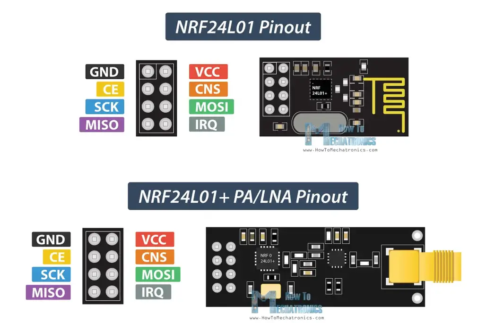

> [**Datasheet**](https://www.mouser.com/datasheet/2/297/nRF24L01_Product_Specification_v2_0-9199.pdf)

---

# Tổng quan phần cứng

## Tần số vô tuyến

Module NRF24L01+ được thiết kế để trong băng tần **2.4 GHZ** thuộc dãi tần **ISM (Industrial, Scientific, and Medical)** và sử dụng phương pháp điều chế [**GFSK (Gaussian Frequency Shift Keying)**](https://en.wikipedia.org/wiki/Frequency-shift_keying#Gaussian_frequency-shift_keying) để truyền dữ liệu.

Tốc độ truyền dữ liệu có thể cấu hình được và có thể thiết lập ở một trong ba mức: 250kbps, 1Mbps hoặc 2Mbps.

> Băng tần 2.4 GHz là một trong những băng tần ISM (Industrial, Scientific, and Medical), được dành riêng trên phạm vi quốc tế cho các thiết bị công suất thấp không cần cấp phép.
>
> Các thiết bị như điện thoại không dây, thiết bị Bluetooth, Near Field Communication (NFC) và mạng máy tính không dây (WiFi) đều sử dụng tần số trong dải ISM này.

## Nguồn

Điện áp hoạt động của module nằm trong khoảng **1.9 - 3.6V**.

<strong>⚠️ Điện áp 5v có thể làm hỏng module</strong> 

Mặc dù module hoạt động trong khoảng 1.9V - 3.6V, nhưng các chân tín hiệu logic có thể chịu được mức điện áp 5V, vì vậy không cần bộ chuyển mức logic khi kết nối với vi điều khiển dùng mức logic 5V.

Công suất phát của module có thể cấu hình ở các mức:

-   0 dBm
-   -6 dBm
-   -12 dBm
-   -18 dBm

Ở mức công suất **0 dBm**, module chỉ tiêu thụ **12 mA** khi truyền tín hiệu, ít hơn cả một đèn LED thông thường.

Điểm đáng chú ý nhất là module rất tiết kiệm năng lượng:

-   Chế độ chờ (Standby Mode): chỉ tiêu thụ **26 µA**
-   Chế độ tắt hoàn toàn (Power Down Mode): chỉ tiêu thụ **900 nA**

➡ Vì vậy, NRF24L01+ là một lựa chọn lý tưởng cho các ứng dụng không dây tiêu thụ ít điện năng.

## SPI Interface

## Thông số kỹ thuật

# NRF24L01 Module Pinout

<ul>
<li class="flex items-center">
    
        GND
    
    Đây là chân GND (Ground - Mass). Chân này có một ký hiệu hình vuông để phân biệt với các chân khác.
</li>

<li class="flex items-center">
    
        VCC
    
    Chân này cung cấp nguồn điện cho module, với mức điện áp từ 1.9V đến 3.9V.Có thể kết nối nó với đầu ra 3.3V của Arduino.
</li>

<li class="flex items-center">
    
        CE (Chip Enable)
    
    Chân này cung cấp nguồn điện cho module, với mức điện áp từ 1.9V đến 3.9V.Có thể kết nối nó với đầu ra 3.3V của Arduino.
</li>
</ul>
